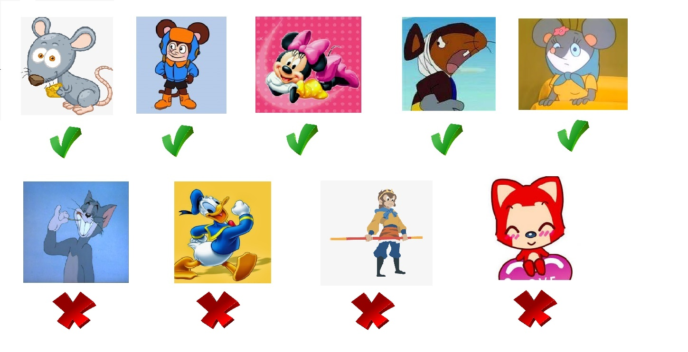

# 机器学习

**深度学习** 是机器学习的一个特定分支。我们要想充分理解深度学习，必须对 **机器学习** 的基本原理有深刻的理解。

首先，我们将介绍 **学习算法** 的定义，并介绍一个简单的示例：**线性回归** 算法。

接下来，我们会探讨 **拟合训练数据** 与寻找能够泛化到新数据的模式存在哪些不同的挑战。大部分机器学习算法都有 **超参数**（必须在学习算法外设定）；我们将探讨如何使用额外的数据设置超参数。

机器学习本质上属于应用统计学，更多地关注于如何用计算机统计地估计复杂函数，不太关注为这些函数提供置信区间；因此我们会探讨两种统计学的主要方法：**频率派估计** 和 **贝叶斯推断**。

大部分机器学习算法可以分成 **监督学习** 和 **无监督学习** 两类；我们将探讨不同的分类，并为每类提供一些简单的机器学习算法作为示例。

大部分深度学习算法都是基于被称为 **随机梯度下降** 的算法求解
的。我们将介绍如何组合不同的算法部分，例如优化算法、代价函数、模型和数据集，来建立一个机器学习算法。

最后，我们会介绍一些限制传统机器学习泛化能力的因素。这些挑战促进了解决这些问题的深度学习算法的发展。

**1、先简单介绍一下机器学习的概念作为入门：**

1. 程序 = 算法 + 数据
2. 程序 = 算法 + 数据 + 领域知识

所谓“机器学习”就是 <b style="color:green">利用计算机将纷繁复杂的数据处理成有用的信息</b>，这样就可以发掘出数据带来的意义以及隐藏在数据背后的规律。

现如今，“机器学习” 和 “大数据” 可以说是IT行业中最热点的两个词汇，而无论是 “机器学习” 还是 “大数据” 最终要解决的问题本质上是一样的，用最为直白的话来说就是 <b style="color:green">用现有的数据去预测将来的状况</b>。

按照问题的 “输入” 和 “输出”，我们可以将用计算机解决的问题分为四大类：

1. 输入的信息是 **精确** 的，要求输出最优解。
2. 输入的信息是 **精确** 的，无法找到最优解。
3. 输入的信息是 **模糊** 的，要求输出最优解。
4. 输入的信息是 **模糊** 的，无法找到最优解。

在上面的四大类问题中，第1类问题是计算机最擅长解决的，这类问题其实就是 “数值计算” 和 “逻辑推理” 方面的问题，而传统意义上的人工智能也就是利用逻辑推理来解决问题（如早期的“人机对弈”）。

一直以来，我们都习惯于将计算机称为“电脑”，而基于“冯诺依曼”体系结构的“电脑”实际上只是实现了“人脑” **理性思维** 这部分的功能，而且在这一点上“电脑”通常是优于“人脑”的，而“人脑”在处理输入模糊信息时表现出来的强大的处理能力，在今天看来也不是“电脑”可以完全企及的。所以我们研究人工智能也好，研究机器学习也好，是希望 <b style="color:green">输入模糊信息时，计算机能够给出满意的甚至是最优的答案</b>。

至此，我们可以给 “机器学习” 下一个定义：<b style="color:blue">机器学习是一门专门研究计算机怎样模拟或实现人类的学习行为，以获取新的知识或技能，重新组织已有的知识结构使之不断改善自身性能的学科</b>。

机器学习目前已经广泛的应用到生产生活的各个领域，以下列举了一些经典的场景：

- **搜索引擎**：根据搜索和使用习惯，优化下一次搜索的结果。
- **电商网站**：自动推荐你可能感兴趣的商品。
- **贷款申请**：通过你最近的金融活动信息进行综合评定。
- **图像识别**：自动识别图片中有没有不和谐的内容。

**2、接下来我们谈一下机器是如何学习的：**

让我们从技术角度看一下机器学习的概念：<b style="color:blue">让计算机程序（机器），不是通过人类直接指定的规则，而是通过自身运行，习得（学习）事物的规律，和/或事物间的关联</b>。

如果我们将 “苹果” 这两个字输入给计算机，计算机并不会幻视出一个水果，也不会像人那样 “意识到” 这个单词的含义。计算机程序所能够处理的，只有 **数值** 和 **运算** 。

计算机程序不过是一段存储在硬盘上的01代码，运行时被读取进内存，CPU 根据代码转换成的指令来做一组特定的操作，让这些01数字通过逻辑电路进行若干运算后，生成计算结果。

>要让一段程序了解客观世界变化万千的事物，则必须将这些事物数值化，将事物的变化和不同事物之间的关联转化为运算。

当若干现实世界的事物转换为数值之后，计算机通过在这些数值之上的一系列运算来确定它们之间的关系，再根据一个全集之中个体之间的相互关系，来确定某个个体在整体（全集）中的位置。

我们继续前面的举例——很可能，我说 “苹果” 的时候，有些人首先想到的不是苹果，而是乔帮主创立的科技公司。但是，我继续说：“苹果一定要生吃，蒸熟了再吃就不脆了。”——在这句话里，“苹果”一词确定无疑指的是水果，而不是公司。因为在我们的知识库里，都知道水果可以吃，但是公司不能吃。出现在同一句话中的 “吃” 对 “苹果” 起到了限定作用——这是人类的理解。

对于计算机，“苹果” 被输入进去的时候，就被转化为一个数值 Va。经过计算，这个数值和对应 “吃” 的数值 Ve 产生了某种直接的关联，而同时和 Ve 产生关联的还有若干数值，它们对应的概念可能是“香蕉”(Vb)、“菠萝”(Vp)、“猕猴桃”(Vc)……

那么据此，计算机就会发现 Va、Vb、Vp、Vc 之间的某些关联（怎么利用这些关联，就要看具体的处理需求了）。

>NOTE 1：
>
>说到数值，大家可能本能的想到 int、double、float……但实际上，如果将一个语言要素对应成一个标量的话，太容易出现两个原本相差甚远的概念经过简单运算相等的情况。假设 “苹果” 被转化为2，而 “香蕉” 被转化为4，难道说两个苹果等于一个香蕉吗？
>
>因此，一般在处理时会 <b style="color:green">将自然语言转化成 n 维向量</b>。只要转化方式合理，规避向量之间因为简单运算而引起歧义的情况还是比较容易的。

<b style="color:green">这种现实世界和计算机之间，概念、数值、关系、运算的映射，造就了机器可以自主学习获得事物规律的可能</b>。

**3、最后我们谈谈机器学习的基本原理：**

既然机器是有可能自己学习事物规律的，那么如何才能让它学到规律呢？

我们先来看一个故事：

```txt
猫妈妈让小猫去捉老鼠，小猫问：“老鼠是什么样子啊？”  
猫妈妈说：“老鼠长着胡须。”结果小猫找来一头大蒜。  
猫妈妈又说：“老鼠四条腿。”结果小猫找来一个板凳。  
猫妈妈再说：“老鼠有一条尾巴。”结果小猫找来一个萝卜。
```

在这个故事里，小猫就是一个 **基于规则(Rule-Based)** 的计算机程序，它完全听命于开发者猫妈妈的指令行事。但是因为三次指令都不够全面，结果，三次都得出了错误的结果。

如果要把小猫变成一个 **基于机器学习模型(Model-Based)** 的计算机程序，猫妈妈该怎么做呢？  

猫妈妈应该这样做，应该给小猫看一些照片，并告诉小猫咪，有些是老鼠，有些不是，比如下面这些：



猫妈妈可以先告诉它：要注意老鼠的耳朵、鼻子和尾巴。然后小猫通过对比发现：老鼠的耳朵是圆的，别的动物要么没耳朵，要么不是圆形耳朵；老鼠都有尾巴，别的动物有的有，有的没有；老鼠的鼻子是尖的，别的动物不一定是这样。  

然后小猫就用自己学习到的：“老鼠是圆耳朵，有尾巴，尖鼻子的动物”的信念去抓老鼠，那么小猫就成了一个“老鼠分类器”。  

小猫（在此处类比一个计算机程序）是 **机器(Machine)**，它成为“老鼠分类器”的过程，就叫做 **学习(Learning)**。

猫妈妈给的那些照片是用于学习的 **数据(Data)**。猫妈妈告知要注意的几点，是这个分类器的 **特征(Feature)**。学习的结果——老鼠分类器是一个 **模型(Model)**。  

这个模型的类型可能是 **逻辑回归**，或者 **朴素贝叶斯**，或者 **决策树**……总之是一个分类模型。

小猫思考的过程就是 **算法(Algorithm)**。

从上，我们就可以总结出机器学习中不可或缺的三大要素：**数据**、**模型**、**算法**。

无论 **有监督学习**，还是 **无监督学习**，都离不开这三要素。什么叫有监督学习？什么又叫无监督学习？我们来解释一下：

## 目录
